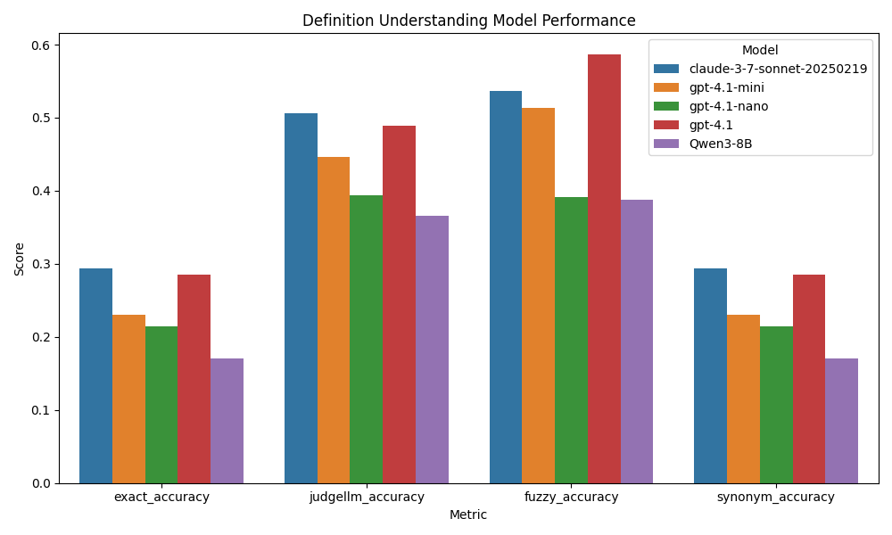

# Definition Understanding

A project to evaluate how well Large Language Models (LLMs) understand word definitions.

## Overview

This project tests LLMs' ability to predict words based on their definitions. The methodology involves:

1. Curating a dataset of words and their definitions from dictionary sources
2. Presenting definitions to LLMs and asking them to predict the corresponding words
3. Evaluating performance using various metrics
4. Accounting for synonyms in the evaluation process

## Model Performance Comparison


*Figure: Performance comparison of evaluated language models on the definition understanding task.*

## Conclusions

- **Claude-3-7-Sonnet** and **gpt-4.1** achieve the highest exact and fuzzy accuracy, with Claude-3-7-Sonnet slightly outperforming gpt-4.1 overall.
- **gpt-4.1-mini** and **gpt-4.1-nano** show lower performance across all metrics, indicating the benefits of larger or more advanced models for this task.
- Fuzzy and synonym-based metrics are notably higher than exact accuracy, highlighting the importance of considering near-misses and alternative valid answers when evaluating language models on definition understanding tasks.
- The results suggest that both model size and architecture play important roles in accurately interpreting and predicting word definitions.

## Project Structure

- `data/`: Contains raw and processed dictionary datasets
   - Download the medical terms dataset from [here](https://github.com/glutanimate/wordlist-medicalterms-en/blob/master/wordlist.txt)
- `src/`: Source code for the project
  - `data_processing/`: Scripts for data acquisition and preprocessing
  - `evaluation/`: Modules for evaluating LLM performance
  - `models/`: Interfaces to different LLMs
- `notebooks/`: Jupyter notebooks for analysis and visualization
- `tests/`: Unit tests

## Getting Started

1. Set up environment variables:
   - Copy `.env.example` to `.env` in the project root:
     ```bash
     cp .env.example .env
     # On Windows (PowerShell):
     copy .env.example .env
     ```
   - Edit `.env` to fill in your HuggingFace token and any other required variables.

2. Set up the environment:
```
Install uv if not already installed:
pip install uv

Create and activate a virtual environment:
`uv venv`
On windows:
`venv\Scripts\activate`
On linux:
`sudo venv/bin/activate`

Install dependencies:
uv sync
```

3. Run the data collection script:
   ```bash
   python src/data_processing/collect_dictionary.py
   ```

3. Evaluate an LLM:
   ```bash
   python src/evaluation/evaluate_model.py --model [MODEL_NAME]
   ```

## License

MIT